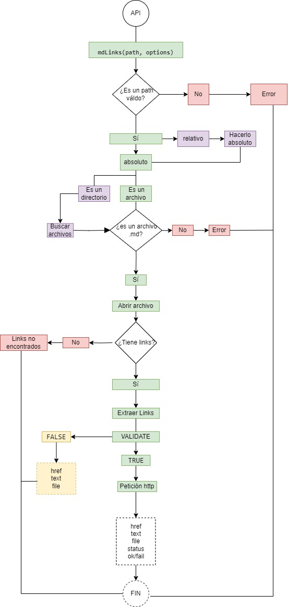
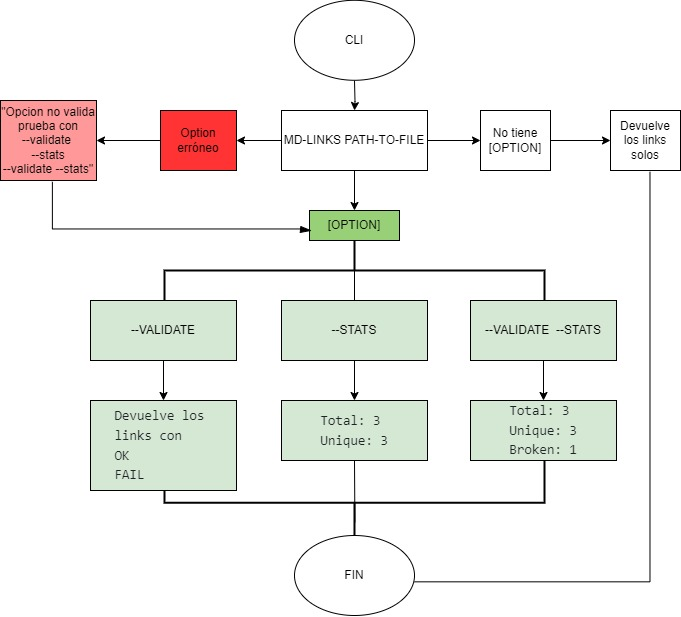

# Markdown Links

## Índice

* [1. Preámbulo](#1-Resumen)
* [2. Resumen del proyecto](#2-resumen-del-proyecto)
* [3. Objetivos de aprendizaje](#3-objetivos-de-aprendizaje)
* [4. Consideraciones generales](#4-consideraciones-generales)
* [5. Criterios de aceptación mínimos del proyecto](#5-criterios-de-aceptación-mínimos-del-proyecto)
* [6. Entregables](#6-entregables)
* [7. Hacker edition](#7-hacker-edition)
* [8. Pistas, tips y lecturas complementarias](#8-pistas-tips-y-lecturas-complementarias)
* [9. Checklist](#9-checklist)
* [10. Achicando el problema](#10-achicando-el-problema)

***

## 1. Resumen

Markdown links es una herramienta de línea de comando (CLI) y
propia librería (o biblioteca - library) en JavaScript para detectar links rotos.

## 2. Diagramas de flujo

Para empezar este proyecto se realizaron dos diagramas de flujo para así poder tener trazados los pasos a seguir. Uno para la api y el otro para la línea de comando.

